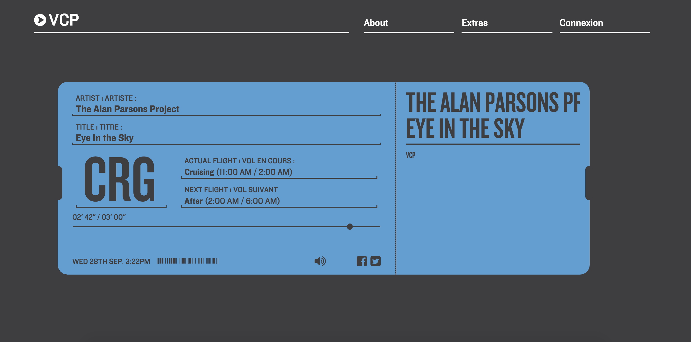
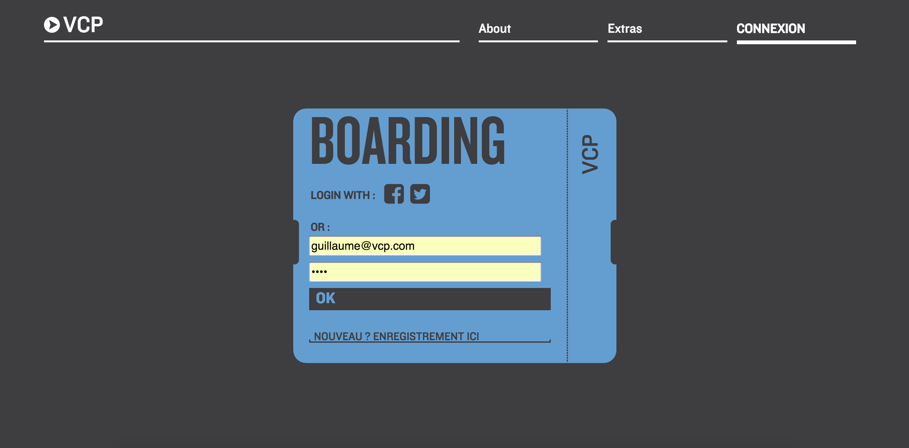
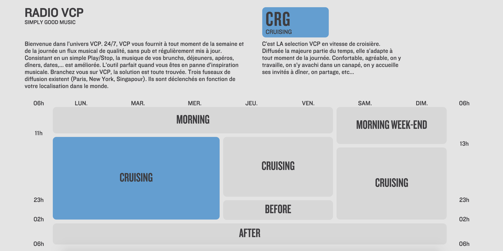
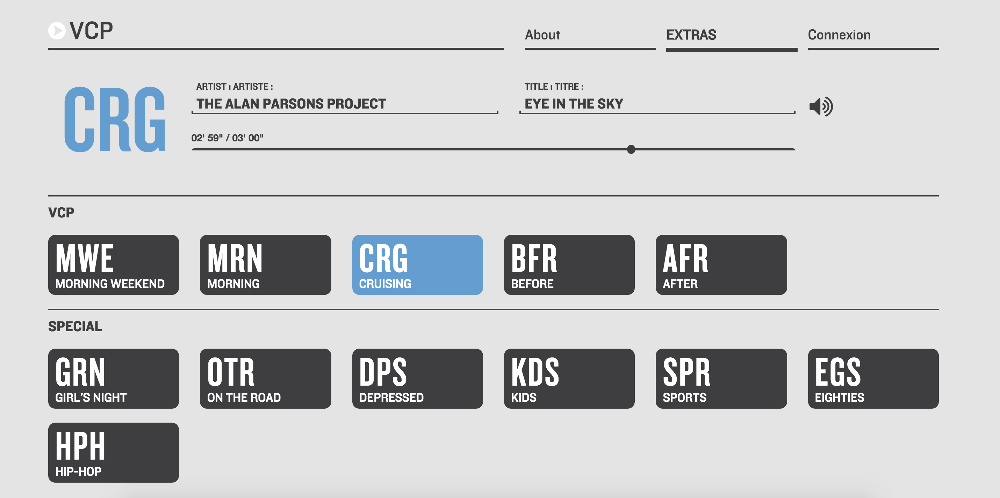

<h1 align="center">📻 VCP - Web Radio</h1>

<p align="center">
  🎸 <i>An amateur radio application</i> 🎸
  <br>
  <small>Built with AngularJS and Laravel 5.</small>
  <br>
  Used to be deployed on <a href="http://vendredicestpermis.com/"><b>http://vendredicestpermis.com/</b></a> and on <a href="http://radiovcp.com/"><b>http://radiovcp.com/</b></a>
</p>

<p align="middle" style="margin-bottom:40px; margin-top:32px; width:100%;">
  
  
  
  
</p>

## 🧸 Product description

**The application is not deployed anymore.** We decided to shut it down in 2019.

TL;DR: VCP is an amateur radio application. It contains several playlists which are played one after the other, in an order defined by a static planning. You can see the planning in the 3rd screenshot. If you want to play a specific playlist in the "Extras" page.

The main screen of the app is the "Ticket" view, where you can start the radio and see which songs is currently played.

After 15 minutes, the user must log in, otherwise the radio will stop. He can do so in the authentication part of the app.

The "About" view shows the actual playlists planning. There is no way to update that planning for now.

The "Extras" view shows the available playlists. By default, the one being played is the one defined in the planning and corresponding to the current date and time. But the user can switch to another playlist, just by clicking on it in this view.

## 📚 How to contribute?

Unfortunately, the radio source has been shut down so this app is completely useless now. But if you're interested in building a web radio player, feel free to contact me.

## 👨‍💻 Stack

This UI part has been done with **[AngularJS](https://angularjs.org/)**, **Bootstrap 3** and the **[Angular SoundManager2](http://perminder-klair.github.io/angular-soundmanager2/)** library.

The backend has been built with **[Laravel 5](https://laravel.com/)**, using a MySQL database.

The whole app is deployed with **[Rocketeer](http://rocketeer.autopergamene.eu/)** on **[DigitalOcean](https://www.digitalocean.com/)**.

## 💻 Installation and Usage
As this project uses Laravel 5, you can follow this [getting started with Laravel 5 tutorial](https://laravel.com/docs/5.1/quickstart). 

Then, you'll have to update the .env file to set the correct database credentials and you'll have to update your Homestead configuration. Once you're done, run : 
```
vagrant up --provision
```


